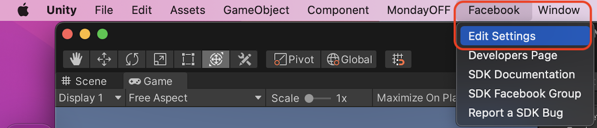
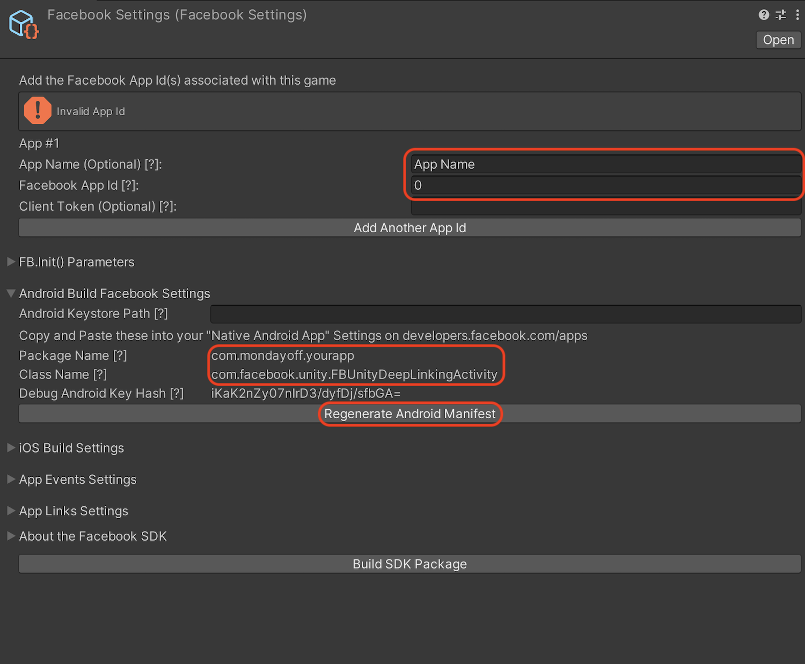
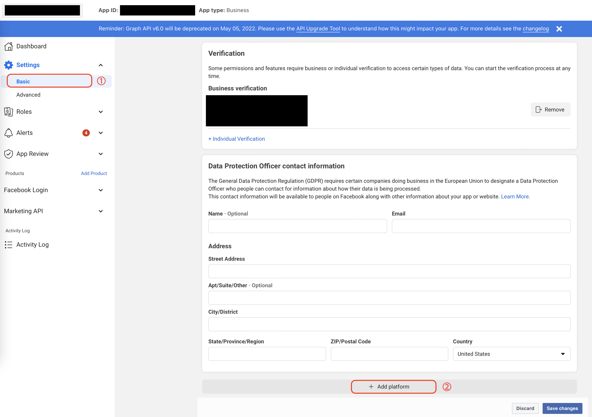
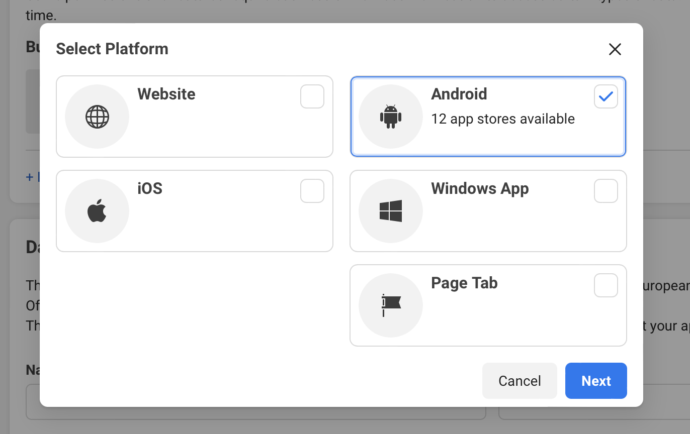

# MondayOFF SDK

### Requirements
---
- Faceboook App ID
- Facebook SDK (included in the package)
    - Please refer to https://developers.facebook.com/docs/unity/ for more information about Facebook SDK

### Installation
---
- Add **MondayOFFSDK.unitypackage** to your project.

### Usage
---
1. Select *Facebook > Edit Settings* on the menu

1. Add Facebook `App Name` and `App ID` in the inspector and click `Regenerate Android Manifest`

1. Move to the basic setting page on the Facebook developer page, Scroll down and click on “Add Platform”

1. Select Android and add Google Play to the platform

1. Add the application's **Package Name** and **Class name** (`com.facebook.unity.FBUnityDeepLinkingActivity`) from step 2

1. Add **Assets/MondayOFF/Prefabs/MondayOFF.prefab** to your starting scene.
    - You can also create MondayOFF Game Object to current working scene by selecting *MondayOFF > Create MondayOFF Game Object* on the menu   
    Don't forget to save the scene!

1. Make sure all Android Libraries are resolved when building application
            
---
### Note
- If you are initializing Facebook SDK on your own, select MondayOFF Game Object and uncheck **Also initialize Facebook SDK** from the inspector.

